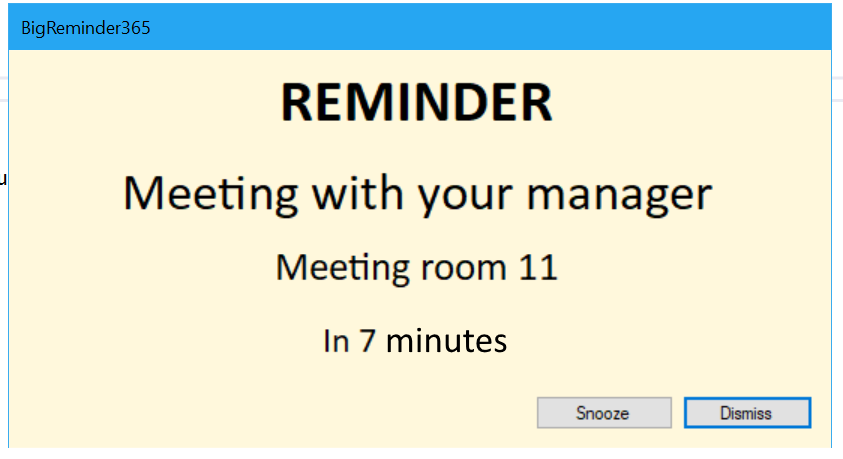
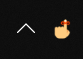
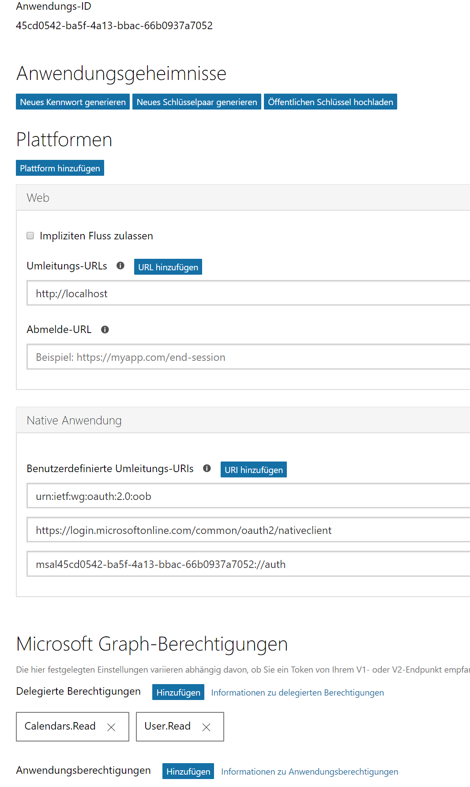

## BigReminder 365

Do you think, the default Outlook appointment reminder is a bit too friendly? Just click dismiss and forget the next meeting.

Here is my solution based on the Office Graph API and a (really really) simple WinForms app.

It is not a friendly app... it's more like a really annoying nag screen ;-)

**Please note: It is not a production ready app. It's mainly for me to learn about using the Graph Api.**

If you have an idea to make this tool even better, feel free to create an issue or a pull request.

### How does it looks like?

The window stays on top and changes it's color from light yellow to a screaming red if there is no time left.
With the `Snooze` button you can hide the window for 1 minute. There is even a `Dismiss` button to close the reminder, like the one in Outlook.
Maybe I need remove it to never forget a meeting anymore...

There is also a notification icon in the taskbar. It has no functionality right now.

### I just want to download it

Go to the [release tab](https://github.com/mwiedemeyer/BigReminder365/releases) and download the zip file. Extract it and run `BigReminder365.exe`.

### Technical Details

The entire logic is in Form1.cs (*Not a best practice! Do not try this at home!*)

If you start the app the first time you will get a Office 365 login screen. Login with a 'Work or school account' (with a cloud mailbox/Exchange license).
It is based on this sample: [active-directory-dotnet-desktop-msgraph-v2](https://github.com/Azure-Samples/active-directory-dotnet-desktop-msgraph-v2)

After you have accepted the consent screen, that this app can read your calendar, it starts checking your calendar every 30 minutes for new/upcoming appointments.

You can now add a link to the tool to your startup group (`WIN+R` -> `shell:startup`).
The saved login token is encrypted by the Windows Data Protection API (DPAPI) in the user scope, so no one can steal your saved login token.

### I want to have control over the permissions

Go to [https://identity.microsoft.com](https://identity.microsoft.com) and register your own app. Replace `s_clientId` in Form1.cs with your own client id you have generated.
If you change the scopes, update `s_scopes` in Form1.cs with your own permission scopes.
The important thing here is the native app platform with these special redirect URIs.
Below that you define the Microsoft Graph scopes.

*Sorry for the german screenshot. You should be able to get the info you need even without knowing a german word.*

